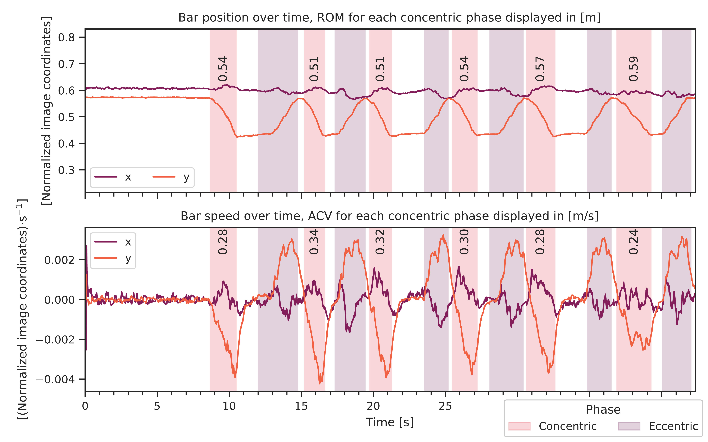

# Velocity Based Training using TFLite object detection
This is a proof of concept project implementing barbell velocity tracking using TFLite models to detect and track the weight plates in a video. [TFLite object detection models](https://www.tensorflow.org/lite/models/modify/model_maker/object_detection) can than be run on mobile devices, forming the bases of a mobile application for real-time velocity tracking during training.

Displayed below is a visualization of the bar path tracking (`track.py` script) and also the metric analysis displaying the concentric range of motion and average concentric velocity (`plot.py` script).

<p align="center">
    
    
</p>

## Setup
Install the dependencies by running the following commands. I'd recommend using a virtual environment with Python 3.9 since from my experience installing the `tflite_model_maker` package in newer versions of Python resulted in a bunch of dependency conflicts.
This package is only needed if you plan to train your own TFLite models and could be skipped otherwise.


```
pip install -r requirements.txt
pip install matplotlib==3.8.0
```

Unfortunatelly it's needed to separately install a newer version of `matplotlib` and ignore the dependency error. The `tflite_model_maker` [requirements](https://github.com/tensorflow/examples/blob/master/tensorflow_examples/lite/model_maker/requirements.txt) specify a version of `matplotlib` that's quite old and would introduce [errors](https://github.com/tensorflow/examples/blob/master/tensorflow_examples/lite/model_maker/requirements.txt) when plotting the pandas dataframes with seaborn.

## Usage
To track the barpath in a video use the `track.py` script. You can use the following arguments to export the dataframe containing tracking information in time or export the video with detections. For more information use the `--help` parameter.

```
python track.py --video_dir out/ --df_dir dfs/ video_to_analyze.mp4
```

To analyze the bar path and plot the metrics use the `plot.py` script. Again, use `--help` for more information.

```
python plot.py --show_fig dfs/df_to_plot.pkl.gz
```

It's important to note that from my experience the performance of quantized models seems to be a bit slower on CPU when using the TFLite interpreter than what I've seen testing them on mobile devices and also when compared to the [official benchmarks](https://www.tensorflow.org/lite/models/modify/model_maker/object_detection#quickstart). It's also possible that there is some optimization that I've missed in which case feel free to correct me.

## Sample videos
I've gathered a couple of videos for testing that can be downloaded from [GDrive](https://drive.google.com/drive/folders/1h_9hC_3yFIdNILJbP_s1Os9IwnwqqHF1?usp=sharing) together with the videos displaying the tracked objects. The generated dataframes and figures for these videos can be found in the `dfs` and `figs` directiories respectively.

## Training
TFlite models in the `model` directory were created just by running `train.py` script.

```
python train.py
```

To further customize the architecture or training parameters please see the [official documentation](https://www.tensorflow.org/lite/models/modify/model_maker/object_detection). The dataset provided in the `data` folder is a mixture of my personal images and a dataset found on Roboflow [1].

You can find the logs from training each model in the `models` directory. Below are the Precision-Recall and ROC curves for the trained models evaluated on the testing dataset with an IoU thresholds of 0.5 to classify detections as correct when calculated against the annotated bounding boxes.

<p align="center">
    
    
</p>

---

[1] Barbell Detector Dataset. Roboflow, Sep 2022. Visited on 2024-03-09. https://universe.roboflow.com/personal-yvwij/barbell-detector-svmfh.